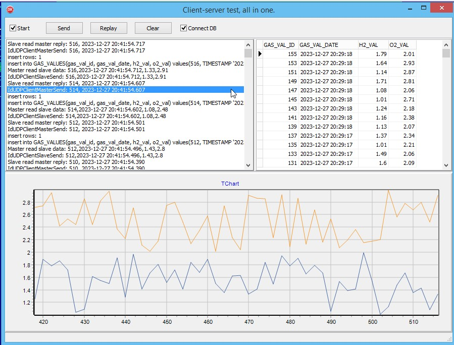

## Пример клиент серврного приложения

Демо работы в одном приложени. Порты 8000 мастер, 8001 слейв. 

### Файлы

* [Unit1.pas](Unit1.pas)
* [Model.pas](Model.pas)
* [LogFile.pas](LogFile.pas)
* [Конфигурация соединения с БД](dbxconnections.ini)
* [Скрипт созадания БД](stal.sql)

***

***

***
